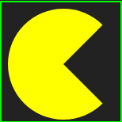
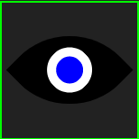
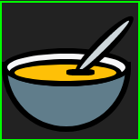
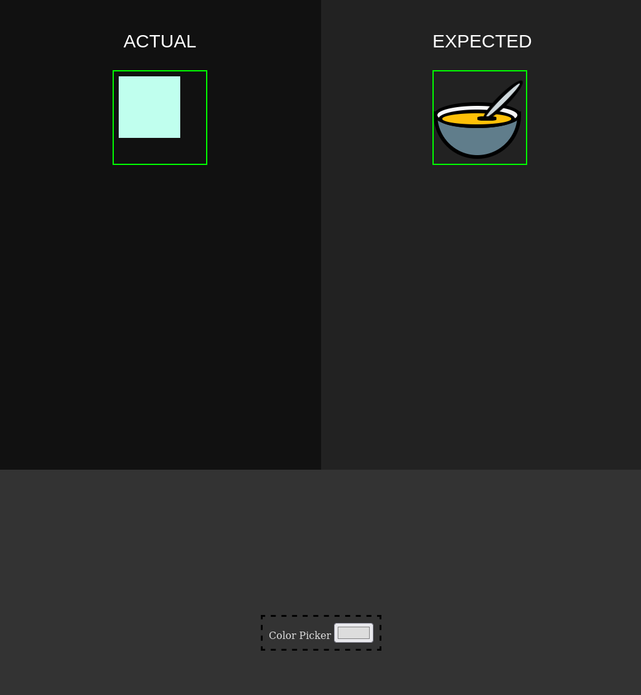
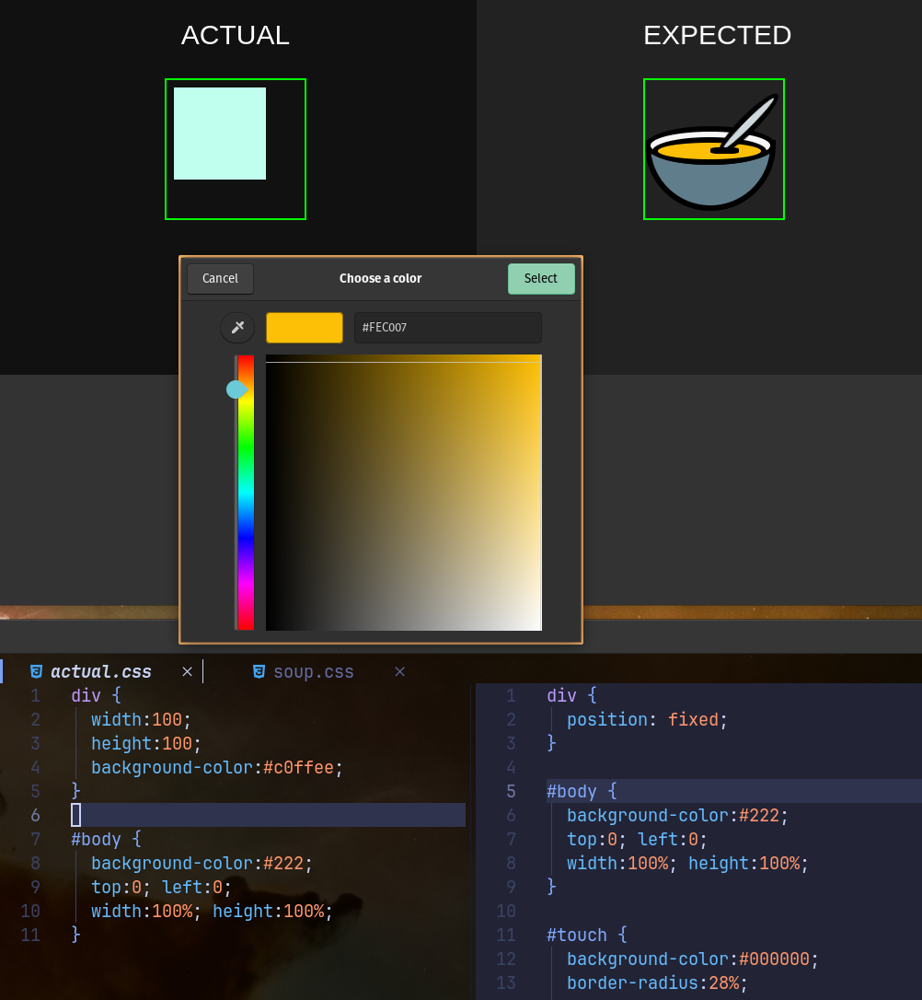

# CSS Solitaire

In CSS Solitaire you have to imitate CSS designs until your replica is close enough.

The advantage is, it doesn't need logins and it doesn't need a web connection.
But in the end, you are on your own, hence solitaire.

So far I only added three demo designs, but further designs can be added to the
`./designs` directory.

## Setup

Clone the repo and type `make`, which will open the workbench file (`./src/workbench.html`) in your browser.

Start editing `./temp/actual.css` and `./temp/actual.html` until you are happy
with your replica.

## Tasks

Basics:

 - [ ] make algorithm compare image to CSS replica (allow comparison to have some predefined tolerance).
 - [ ] allow user to pick his own tolerance for the comparison.
 - [ ] add more designs.
 - [ ] implement a picker for the expected CSS design, eg as a drop-down grid of the designs in `./designs/`.
 - [ ] implement in pure javascript.

Extras:

 - [ ] implement helper tool: color picker.
 - [ ] publish the whole thing as a vue3 component.

## Preview

This is what the page looks like. I also included a color picker to aid editing
the CSS.

## Meta

It is inspired by [cssbattle.dev](https://cssbattle.dev/).

